# Spacecraft Mock Interface

A mocked, interactive control interface for a fictional spacecraft. When you dreamed of flying a
spaceship, here you go.

This is a playground: a captain's dashboard for an interstellar ship, built as a single-page
application with consoles for navigation, propulsion, communications, science, ship status,
weapons/defence, and system logs — all driven by mocked, client-side state.

The interface is designed **for e-ink displays** first. It runs as an installable PWA in
landscape orientation, uses only high-contrast black-and-white rendering, and disables all
animation and transition effects to avoid the ghosting and lag typical of e-ink refresh cycles.
It is developed and tested on a 13-inch MacBook Air (2560×1664 logical resolution), which is the
reference viewport for all layout and spacing decisions.

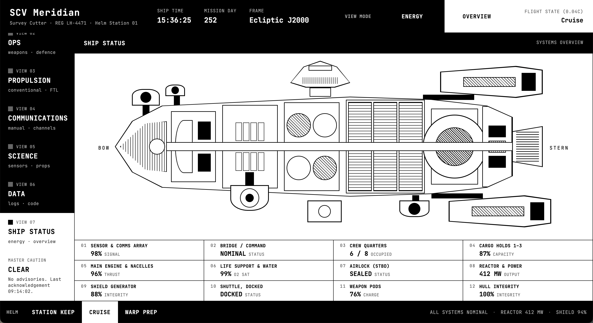

## Handbook: the helm station

The interface is organized as a set of consoles, selectable from the navigation rail on the left.
Each console mirrors a physical station a helm officer would work from, mocked with plausible
instrumentation, dials, and diagrams rather than live telemetry.

### Ship Status

Overview of the vessel: hull/system diagram, subsystem health panel, and energy distribution
across ship systems. Power can be reallocated between systems with the energy dialer, and the
reactor can be shut down from here.

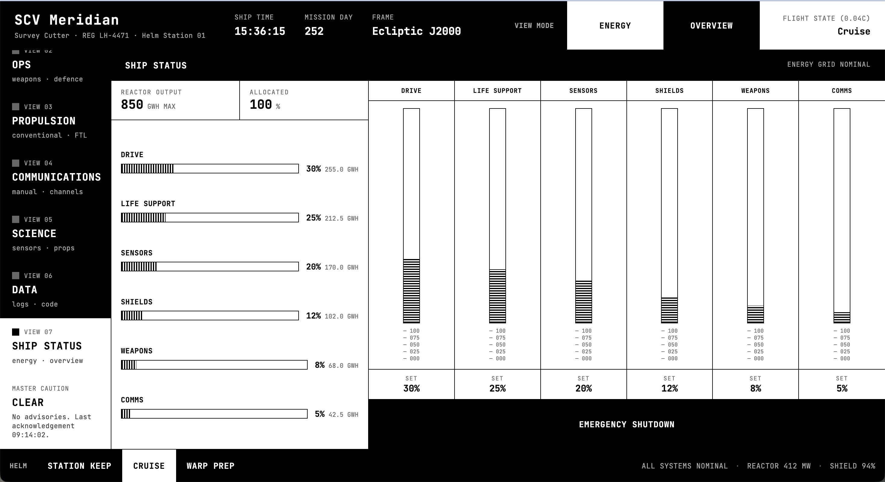

### Navigation

Two modes of flight control:

- **Automatic** — autopilot following a plotted course, with a star chart and gyrocompass for
  situational awareness.
- **Manual** — direct law flight using RCS and main drive: a steering wheel, thrust dialer, and
  thrust vector panel, with quick actions to null rates or align to the current waypoint.

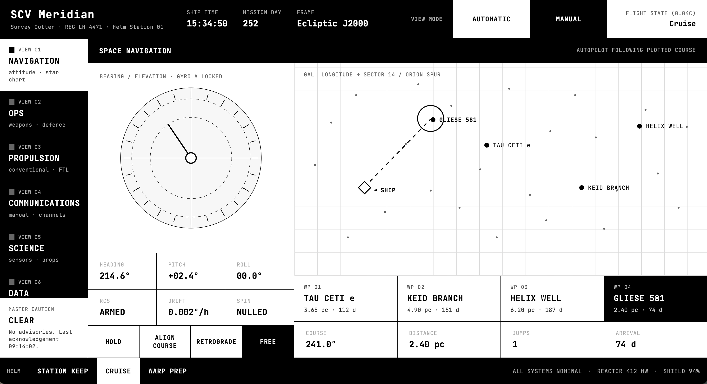
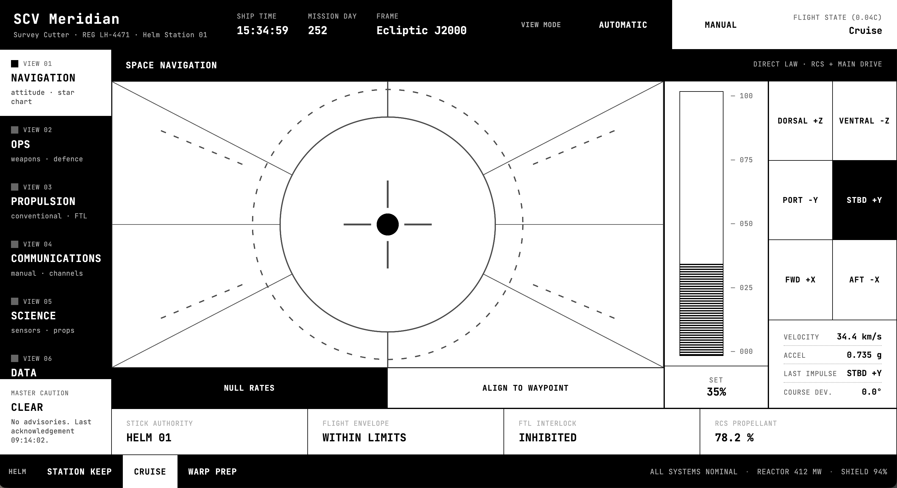

### Propulsion

Reactor power management, the FTL (faster-than-light) drive with intermix and field coil
controls and a warp diagram, plus conventional torch cluster control with per-torch cards and a
tokamak gauge for the fusion reactor.

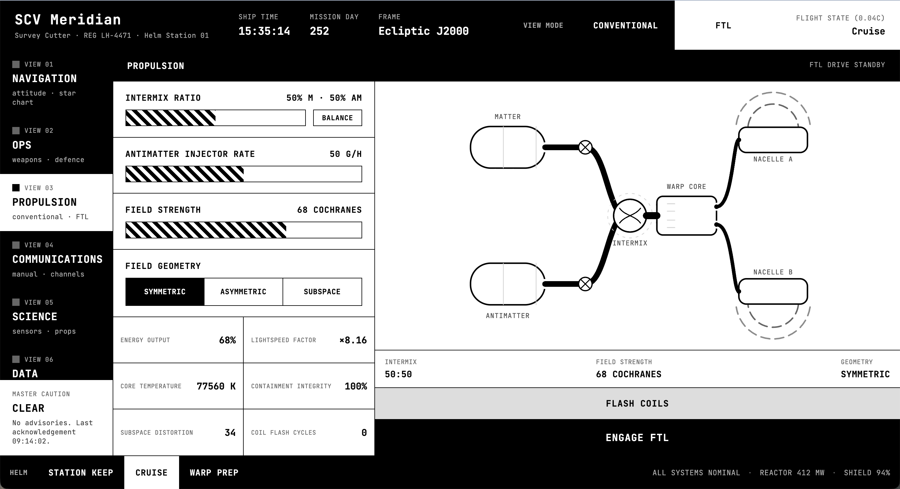
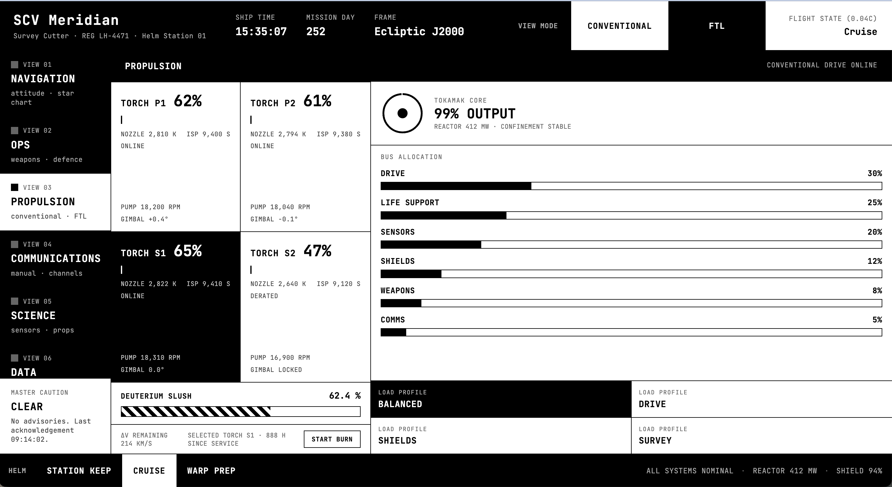

### Communications

Channel grid and channel control panel for hailing frequencies, plus a manual tuning panel with
a frequency-band diagram for fine control over the comms array.

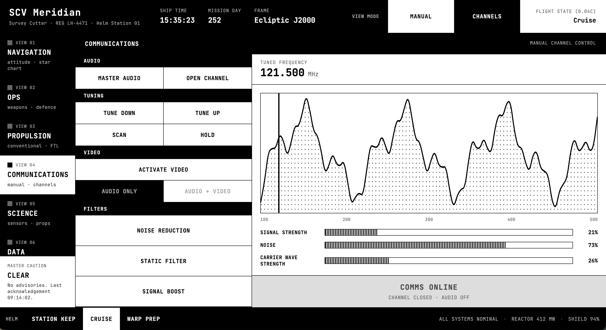
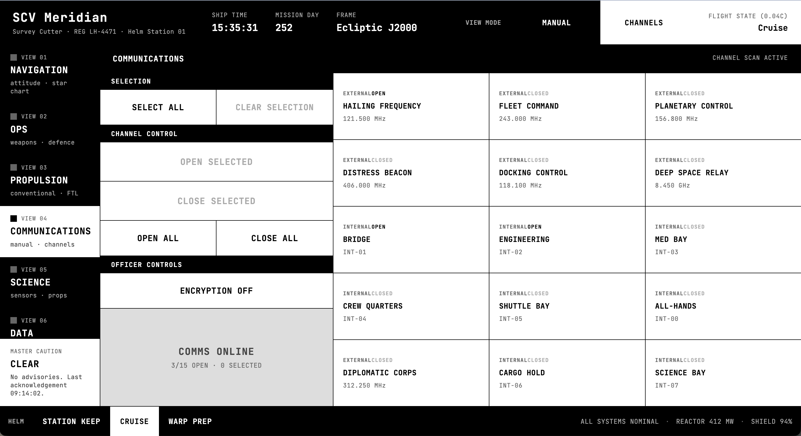

### Science

Sensor suite readouts across a sensor field, and a probe deployment panel with a deployment
diagram for launching and tracking probes.

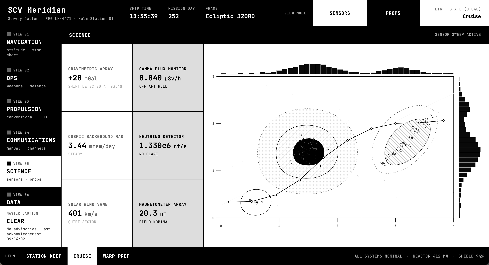
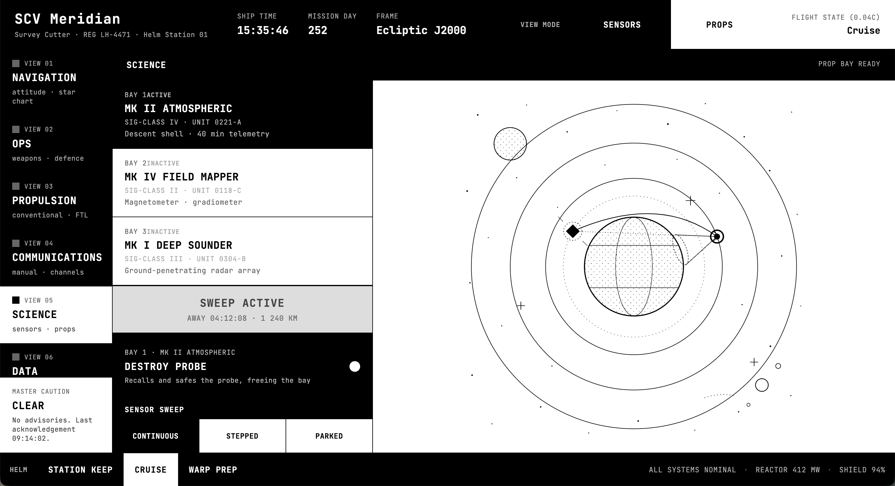

### Ops: Defence and Weapons

Shield control across quadrants (a shield diagram and per-quadrant cards), and a weapons control
panel with a targeting map for offensive systems.

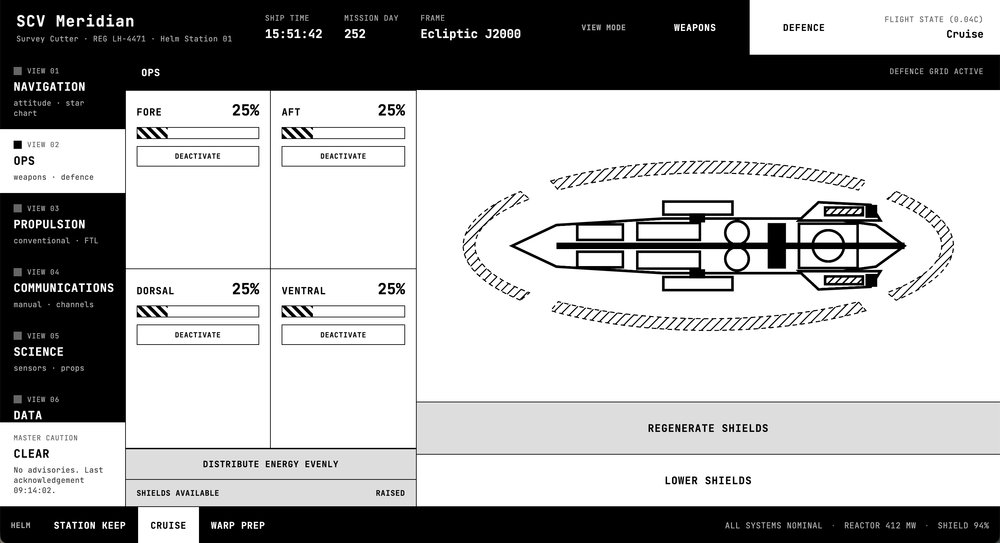
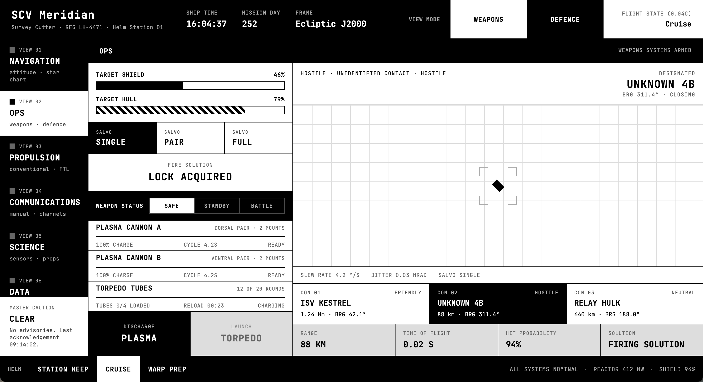

### Data

Ship's log: a browsable log list with detail view. Includes a code console for entering
authorization codes, and a self-destruct panel gated behind that code entry.

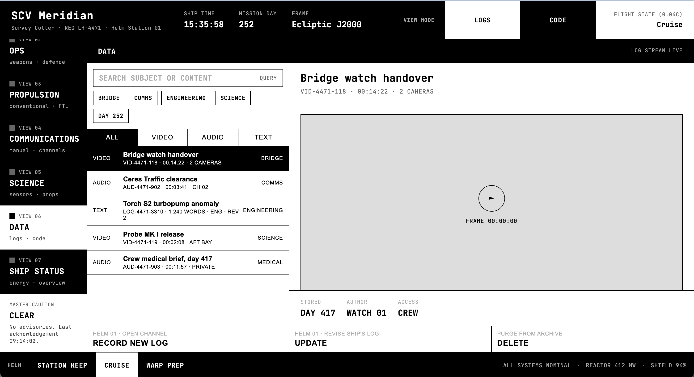
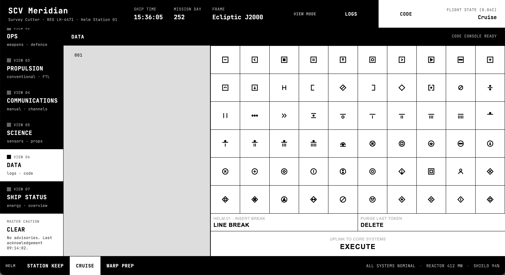

### Always-on chrome

A dashboard header and footer frame every console, and a master caution indicator surfaces ship
advisories and the last acknowledgement time regardless of which console is active. The app
enforces landscape orientation and shows a rotate-device notice in portrait.

## Architecture & tech stack

- **React 19** + **TypeScript**, built with **Vite**.
- **Zustand** for state management — one store per subsystem (e.g. `navigation.store.ts`,
  `ftl-drive.store.ts`, `shields.store.ts`, `weapons.store.ts`, `energy-distribution.store.ts`),
  composed under a top-level `spacecraft.store.ts` / `ship-systems.store.ts`. All ship state is
  mocked in-memory; there is no backend.
- **Views and components**: each console is a `*.view.tsx` in `src/views`, composed from
  presentational components under `src/components/<domain>/`, each following
  `*.component.tsx` + co-located `*.component.css` + `*.component.test.tsx`.
- **Biome** for linting and formatting (2-space indent, double quotes, 100-char line width).
- **Vitest** + **Testing Library** + **jsdom** for unit/component testing, with a 1:1 test file
  per component/hook/view.
- **vite-plugin-pwa** for installable PWA support (manifest, icons, splash screens, offline
  caching via Workbox), configured for `standalone` display and `landscape` orientation.
- Custom hooks (`src/hooks`) encapsulate cross-cutting concerns such as orientation detection and
  active-view state.

## How to start

```bash
git clone https://github.com/AlexisRoe/spacecraft-mock-interface.git
cd spacecraft-mock-interface
npm ci
npm run dev
```

The dev server runs at [http://localhost:9055](http://localhost:9055).

Other useful commands:

```bash
npm run build       # tsc -b && vite build
npm run lint         # biome lint .
npm run format      # biome format --write .
npm run check       # biome check --write . (lint + format)
npm test            # vitest (watch mode)
npm run test:ui     # vitest --ui
npm run coverage    # vitest run --coverage
```

## Installing as a PWA

This app is a Progressive Web App: it ships a manifest, a service worker (via
`vite-plugin-pwa`/Workbox), and icons/splash screens for offline-capable, standalone installation
on desktop and mobile — including e-ink tablets. Once installed it launches without browser
chrome, locked to landscape orientation, matching how it would run on a helm station display.

To install:

1. Open the app URL (`npm run dev` locally, or your deployed URL) in a PWA-capable browser
   (Chrome, Edge, or the browser on your e-ink device).
2. Use the browser's install prompt — e.g. the install icon in the address bar (Chrome/Edge on
   desktop), or "Add to Home Screen" (Android/e-ink tablet browsers), or "Add to Dock" (Safari on
   macOS/iPadOS).
3. Launch the installed app from your home screen/app list; it runs standalone in landscape.

### A note on e-ink displays

E-ink tablets typically render web content at a fixed OS-level pixel density that doesn't match
the panel's native DPI, which can make fine details (borders, small text) look thicker or thinner
than intended. Most e-ink devices expose a **display scaling/DPI setting** (sometimes labeled
"font/display size" or "resolution") in their system settings — adjust this until the
high-contrast borders and text in the interface render crisply at 1:1 pixel scale, rather than
relying on the browser's own zoom.

## Contribution

Contributions are welcome. Before opening a pull request:

- Follow the conventions in `CLAUDE.md` — filename suffixes (`*.component.tsx`, `*.hook.ts`,
  `*.view.tsx`), JSDoc on all exported types/functions, and the e-ink UI constraints (no
  animations/transitions, high-contrast black-and-white only, no gradients/shadows).
- Keep the 1:1 pairing of source files with co-located tests.
- Run `npm run check` and `npm test` before submitting.
- Keep the feature surface small and distraction-free — this is a deliberate design constraint.

## License

MIT — see [LICENSE](LICENSE).
